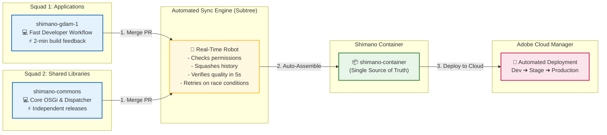
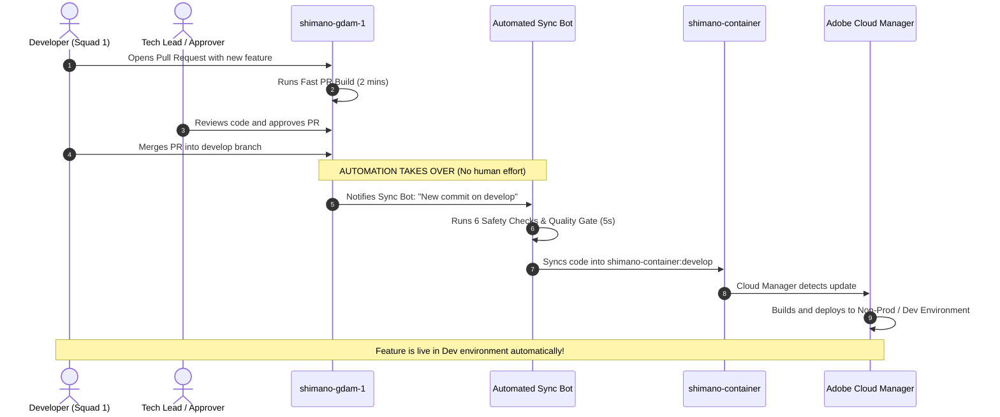

# Shimano Multi-Repository Platform: Executive & Business Overview

> **Audience**: Product Owners, Engineering Leaders, Delivery Managers, and Business Stakeholders  
> **Topic**: How Shimano combines high team agility with enterprise-grade Adobe Cloud Manager deployments  
> **Confluence Space**: *Engineering > Product & Delivery > Architecture Overview*

---

## 1. Executive Summary

Modern enterprise AEM platforms face a fundamental trade-off:

```
           TRADITIONAL MONOLITH                          MULTI-REPO AGGREGATOR
     (All teams in one big repository)           (Independent repos + Smart Container)
  ❌ Slow PR builds (15-30 mins)               ✅ Lightning-fast PRs (1-2 mins)
  ❌ Merge conflicts between squads            ✅ Squad autonomy & zero interference
  ❌ Risk of single bad commit blocking all     ✅ Automated quality gate & safety shields
  ❌ Difficult access control & governance     ✅ Granular repository access permissions
```

The **Shimano Multi-Repository Container Architecture** solves this challenge. It gives development squads independent repositories to build features quickly while automatically assembling code into a single container for **Adobe Cloud Manager** deployments.

---

## 2. High-Level Concept Diagram



---

## 3. Key Business & Operational Benefits

### ⏱️ 1. 80% Faster Developer Feedback Loop
- In a traditional monolith, a developer waiting for PR checks must wait for all modules across the entire company to compile (15–30 minutes).
- With our architecture, developers only test their own repository's modules. PR verification finishes in **under 2 minutes**.

### 🛡️ 2. Zero-Disruption Production Deployments
- Cloud Manager requires a unified repository to build the final production release packages.
- Our container automatically combines all repos without developers having to manually copy-paste code or run complex merging ceremonies.

### 🔒 3. Enterprise Safety Shield & Governance
- **Zero Accidental Overwrites**: If someone tries to sync an unapproved branch (e.g. `test-branch`), the automation safely ignores it.
- **Pre-Push Quality Gate**: The aggregator runs a lightweight 5-second health check before accepting any code. If a file is broken, it blocks the push before Cloud Manager ever sees it.
- **Race Condition Immunity**: When multiple squads merge at the exact same moment, our retry system queues and merges the changes seamlessly.

---

## 4. A Day in the Life: How It Works in Practice

Let's walk through an everyday example of how a feature travels from a developer's laptop to production:



---

## 5. Summary Table for Leadership

| Metric / Aspect | Before (Monolithic Approach) | After (Shimano Multi-Repo Solution) |
| :--- | :--- | :--- |
| **Squad Autonomy** | Low (Squads block each other during merges) | **High (Each squad owns their codebase)** |
| **PR Build Duration** | 15 – 30 minutes | **~1 to 2 minutes** |
| **Deployment Effort** | Manual tagging, coordination meetings | **100% Automated upon Git merge** |
| **Scalability** | Gets slower with every new squad added | **New squad repos can be plugged in easily** |
| **Cloud Manager Compatibility** | Standard | **100% Compatible via Aggregator Container** |
| **Risk of Broken Main** | High | **Low (Protected by pre-push validation gates)** |

---

## 6. Frequently Asked Questions for Project Managers

**Q: Do developers need to work in `shimano-container` directly?**  
*A: No. Developers only work in their specific project repository (`shimano-gdam-1`, `shimano-commons`, etc.). The container is updated automatically by our bots.*

**Q: What happens if an external agency joins to build a new sub-site?**  
*A: We create a new repository (`shimano-dealer`) for the agency. They cannot break existing squad code. Once tested, their repo is plugged into the container seamlessly.*

**Q: Can a bad commit break Cloud Manager deployments?**  
*A: No. Our two-tier quality gates (PR validation in source repo + Pre-Push Maven reactor check in container) reject broken code before it is pushed to Cloud Manager.*
