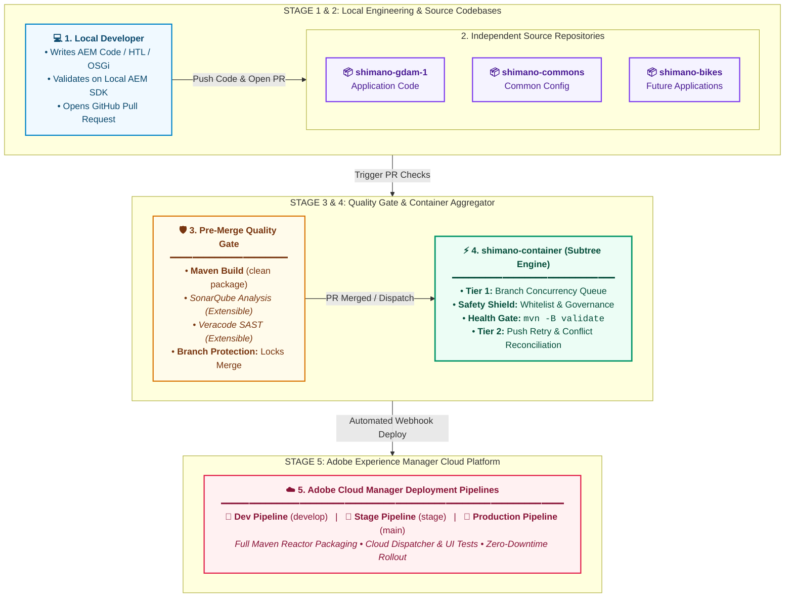
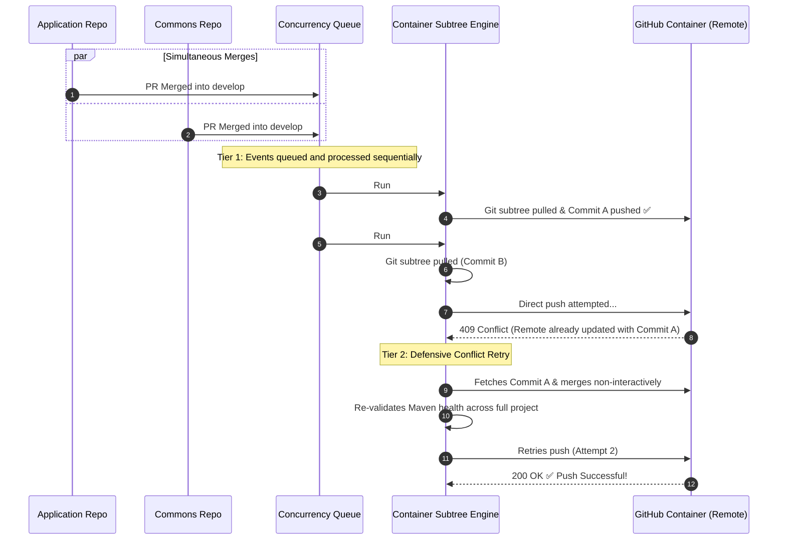

# Shimano Experience Platform: Multi-Repository Delivery Playbook

> **Target Audience**: Development Teams, Tech Leads, Solution Architects, Security Engineers, and Product Leadership  
> **Platform**: Adobe Experience Manager as a Cloud Service (AEMaaCS), GitHub Actions, Git Subtree  
> **Confluence Space**: *Engineering > Architecture & Delivery > Platform Playbook*

---

## 1. Executive Snapshot: Why Multi-Repository?

Enterprise digital platforms must balance **team independence** with **centralized deployment stability**. Shimano achieves this by decoupling code into independent source repositories while automatically aggregating them for unified Adobe Cloud Platform deployments.

```
┌─────────────────────────────────────────────────────────────────────────────────────────────────┐
│                                   THE THREE VALUE PILLARS                                       │
├───────────────────────────────┬─────────────────────────────────┬───────────────────────────────┤
│    ⚡ RAPID BUILD FEEDBACK    │    🛡️ ZERO-TOUCH AUTOMATION     │    🔒 EXTENSIBLE SECURITY     │
│  Independent repositories     │  GitHub Actions continuously    │  Architecture readily supports│
│  enable fast, lightweight PR  │  assembles, validates, and      │  integrating SonarQube &      │
│  validations per project.     │  pushes code to Cloud Platform. │  Veracode security gates.     │
└───────────────────────────────┴─────────────────────────────────┴───────────────────────────────┘
```

---

## 2. End-to-End Delivery Flow: From Developer to AEM Cloud



---

## 3. Pull Request Quality & Security Gates (Indicative Extensibility)

Each source repository enforces automated validation on pull requests. The architecture is designed to allow **SonarQube code analysis** and **Veracode security scanning** to be seamlessly introduced alongside the standard Maven build:

```
                  ┌───────────────────────────────────────────────┐
                  │              PULL REQUEST OPENED              │
                  └───────────────────────┬───────────────────────┘
                                          │
                  ┌───────────────────────┴───────────────────────┐
                  │   PARALLEL AUTOMATED GATES RUN CONCURRENTLY   │
                  └───────────────────────┬───────────────────────┘
                                          │
            ┌─────────────────────────────┼─────────────────────────────┐
            ▼                             ▼                             ▼
  ┌───────────────────┐         ┌───────────────────┐         ┌───────────────────┐
  │  1. Maven Build   │         │ 2. SonarQube      │         │ 3. Veracode SAST  │
  │    (Active)       │         │ (Future / Option) │         │ (Future / Option) │
  │  Fast compilation │         │  Code quality,    │         │  Vulnerability &  │
  │  & package check  │         │  coverage & smells│         │  security policies│
  └─────────┬─────────┘         └─────────┬─────────┘         └─────────┬─────────┘
            │                             │                             │
            └─────────────────────────────┼─────────────────────────────┘
                                          ▼
                      ┌───────────────────────────────────────┐
                      │    ALL REQUIRED CHECKS PASS (GREEN)   │
                      └───────────────────┬───────────────────┘
                                          ▼
                      ┌───────────────────────────────────────┐
                      │  🔓 Merge Button Unlocked in GitHub   │
                      └───────────────────────────────────────┘
```

### How Branch Protection Rules Enforce These Checks:

In GitHub repository settings (**Settings → Branches → Add branch protection rule** for `develop` and `main`):

1. ✅ **Require status checks to pass before merging**:
   - `Validate PR Build` *(Active: runs `mvn -B clean package -DskipTests`)*
   - `SonarQube Code Analysis` *(Can be enabled when SonarQube is onboarded)*
   - `Veracode Security Scan` *(Can be enabled when Veracode scanning is onboarded)*
2. ✅ **Require branches to be up to date before merging** *(Prevents outdated code conflicts)*.

> **Result**: Whenever additional checks (like SonarQube or Veracode) are introduced, simply selecting their names under Branch Protection makes them mandatory prerequisites for merging.

---

### Indicative PR Workflow Configuration (`pr-build.yml`)

> [!NOTE]
> **Customizable Pre-Merge Checks & Toolchain Alignment**: The workflow below is an indicative baseline. Development teams and project leads can modify, customize, or extend the pre-checks (such as adding unit tests, ESLint/Prettier code style checks, SonarQube quality gates, or Veracode SAST scans) as per project-specific quality and security requirements. The Java version in PR validation is aligned with Adobe Cloud Manager runtime requirements (Java 21).

```yaml
name: Pull Request Verification & Security Gates

on:
  pull_request:
    branches: [ develop, main, stage, 'stage-*', 'release/**', 'hotfix/**' ]

jobs:
  # Active Gate: Fast Maven Build Validation (Customizable)
  maven-build:
    name: Validate PR Build
    runs-on: ubuntu-latest
    steps:
      - uses: actions/checkout@v4
      - uses: actions/setup-java@v4
        with: { java-version: '21', distribution: 'temurin', cache: maven }
      - name: Build with Maven
        run: mvn -B clean package -DskipTests

  # Indicative Future Gate: SonarQube Code Quality Analysis
  # sonarqube:
  #   name: SonarQube Code Analysis
  #   runs-on: ubuntu-latest
  #   steps:
  #     - uses: actions/checkout@v4
  #       with: { fetch-depth: 0 }
  #     - uses: actions/setup-java@v4
  #       with: { java-version: '21', distribution: 'temurin' }
  #     - name: SonarQube Scan
  #       env:
  #         SONAR_TOKEN: ${{ secrets.SONAR_TOKEN }}
  #         SONAR_HOST_URL: ${{ secrets.SONAR_HOST_URL }}
  #       run: mvn -B org.sonarsource.scanner.maven:sonar-maven-plugin:sonar

  # Indicative Future Gate: Veracode Static Application Security Testing (SAST)
  # veracode:
  #   name: Veracode Security Scan
  #   runs-on: ubuntu-latest
  #   steps:
  #     - uses: actions/checkout@v4
  #     - name: Veracode Pipeline Scan
  #       uses: veracode/veracode-pipeline-scan-action@v1
  #       with:
  #         vid: ${{ secrets.VERACODE_API_ID }}
  #         vkey: ${{ secrets.VERACODE_API_KEY }}
  #         file: "all/target/*.zip"
  #         fail_on_severity: "High, Very High"
```

---

## 4. Cross-Repository Dispatch Contract & Idempotency

When a pull request is merged in any source repository, `trigger-container.yml` sends a secure **`repository_dispatch`** event containing an immutable audit payload to `shimano-container`:

```json
{
  "event_type": "subtree_sync",
  "client_payload": {
    "source_repo": "shimano-gdam-1",
    "source_branch": "develop",
    "commit_sha": "46423dd6bf726ec1dc8d963d941015cb04c719e0",
    "actor": "octocat-engineer",
    "ref": "refs/heads/develop"
  }
}
```

### Payload Schema Definitions:
- **`source_repo`**: Name of the originating repository, determining the subtree folder prefix (e.g. `shimano-gdam-1/`).
- **`source_branch`**: Name of the target branch in the source repository.
- **`commit_sha`**: Exact Git commit SHA being synchronized for deterministic release tracking.
- **`actor`**: GitHub identity (`github.actor`) associated with the workflow execution, retained for audit and traceability.
- **`ref`**: Full Git ref path (`refs/heads/develop`).

### 🔁 Idempotency Guarantee
> **Idempotency Contract**: For the same source repository, source branch, source commit SHA, and target container branch, processing the same event multiple times must not create duplicate synchronization commits.

If GitHub Actions delivers a duplicate dispatch event or a workflow run is manually re-triggered for the same commit, the synchronization engine evaluates commit hashes after `git subtree pull`:
```bash
if [ "$LOCAL_SHA" = "$REMOTE_SHA" ]; then
  echo "ℹ️ Container is already up-to-date with ${SOURCE_REPO}. No changes to push."
  exit 0
fi
```
Repeated processing of the same source commit is designed to be idempotent and does not create another synchronization commit when that source commit is already represented in the target subtree.

---

## 5. Concurrency Architecture: Primary Queue & Defensive Retry

To handle simultaneous merges across multiple source repositories, the system utilizes a **two-tier concurrency control model**:

```
                                SIMULTANEOUS SYNC EVENTS
                               (GDAM & Commons Merged at t=0)
                                            │
                                            ▼
                    ┌───────────────────────────────────────────────┐
                    │     TIER 1: GitHub Concurrency Queue          │
                    │  concurrency.group = subtree-sync-${branch}   │
                    │  cancel-in-progress: false (Sequential Queue) │
                    └───────────────────────┬───────────────────────┘
                                            │
                                            ▼
                               [ Job 1: Process GDAM ]
                               [ Job 2: Queued...    ]
                                            │
                                            ▼
                    ┌───────────────────────────────────────────────┐
                    │  TIER 2: Defensive Conflict Retry             │
                    │  Fetches, merges, and validates if a push     │
                    │  collision occurs during container git push.  │
                    └───────────────────────────────────────────────┘
```

1. **Tier 1 — Concurrency Queue (Primary Gate)**: GitHub Actions groups runs by target branch (`subtree-sync-develop`). With `cancel-in-progress: false`, jobs are queued sequentially rather than executing in parallel on the same branch.
2. **Tier 2 — Push Retry & Conflict Reconciliation (Safety Net)**: If a concurrent container update causes the push to be rejected (push collision), the synchronization engine fetches the latest container state, attempts a non-interactive merge (`merge --no-edit`), re-runs Maven validation, and retries the push automatically (up to 3 attempts). If Git cannot reconcile the histories automatically, the workflow fails safely for manual engineer resolution.

---

## 6. Real-World Practical Scenarios

### Scenario 1: Developing and Deploying a New Feature
> **Context**: An engineer creates a new interactive Product Carousel component in `shimano-gdam-1`.

1. **Fast PR Feedback**: The engineer opens a PR. Maven quickly verifies compilation, dependencies, and packages without waiting on unrelated projects.
2. **Review & Merge**: The Tech Lead reviews and merges the PR into `develop`.
3. **Automated Subtree Pull**: GitHub Actions triggers `git subtree pull --squash` in `shimano-container`.
4. **Cloud Deployment**: The aggregated container update triggers the configured Adobe Cloud Manager deployment pipeline for the target environment.

---

### Scenario 2: Simultaneous Merges (Conflict Reconciliation)
> **Context**: Two engineers merge PRs in GDAM and Commons at the exact same moment.



---

### Scenario 3: Catching Issues Early (Quality & Security Guardrails)
> **Context**: A pull request inadvertently includes invalid XML, broken module syntax, or a flagged security dependency.

- **Outcome**: The PR check fails during pre-merge validation.
- **Protection in Action**: GitHub marks the check as failed (❌) and **locks the Merge button**.
- **Result**: The issue is caught immediately inside the source repository before ever reaching the container or disrupting Cloud Platform deployment pipelines.

---

### Scenario 4: Adding an Additional Sub-Project (e.g., `shimano-bikes`)
> **Context**: A new team or brand agency is onboarded to build the Shimano Bikes application.  
> **Onboarding Paradigm**: *One-time container POM module configuration + zero-touch source synchronization thereafter.*

1. **Step 1 (Source Repo)**: Add the dispatch workflow [`.github/workflows/trigger-container.yml`](../shimano-gdam-1/.github/workflows/trigger-container.yml) to `shimano-bikes`.
2. **Step 2 (Container POM)**: Add `<module>shimano-bikes</module>` to `shimano-container/pom.xml`.
3. **Step 3 (Automatic Subtree Provisioning on First Sync)**: The container workflow **automatically provisions the project on the very first PR merge**!
   - In `scripts/update_subtree.sh`, the engine automatically detects missing directories:
     ```bash
     if [ ! -d "$SUBTREE_PREFIX" ]; then
       # Subtree directory doesn't exist yet -> Automatically executes 'git subtree add'
       git subtree add --prefix="$SUBTREE_PREFIX" "$SOURCE_REMOTE" "$SOURCE_BRANCH" --squash
     else
       # Subtree directory exists -> Executes 'git subtree pull'
       git subtree pull --prefix="$SUBTREE_PREFIX" "$SOURCE_REMOTE" "$SOURCE_BRANCH" --squash
     fi
     ```
4. **Outcome**: After the one-time container POM configuration, no manual Git CLI commands are required for normal synchronization. The first qualifying merge automatically provisions the subtree, validates the reactor, and—if validation succeeds—updates the container.

---

## 7. The 6-Point Subtree Synchronization Safety Shield

Before any code is pushed to the container repository, the sync script executes **6 automated safeguards**:

| Safeguard | Mechanism | Purpose |
| :--- | :--- | :--- |
| **1. Whitelist Filter** | Evaluates branch against `ALLOWED_BRANCHES` (`main,develop,stage,stage-*,release/*,hotfix/*`). | Feature branches (`feature/*`) are skipped, preserving CI runner minutes. |
| **2. Branch Governance** | Verifies that target branch already exists in `shimano-container`. | Prevents source repos from creating untracked branches in the container. |
| **3. Zero Silent Fallback** | Verifies source branch existence on remote. | Eliminates fallback pollution to `main` by failing fast (`exit 1`) on invalid branches. |
| **4. Git Subtree Squash** | Imports commits using `git subtree pull --squash`. | Keeps container Git history clean (1 concise commit per PR merge). |
| **5. Reactor Health Gate** | Executes `mvn -B validate` across all aggregated modules in seconds. | Validates Maven reactor hierarchy, POM XML schemas, and module linkages before push. |
| **6. Conflict Reconciliation** | Retries up to 3 times with `fetch + merge + re-validate`. | Defensive safety net against push collisions during rapid concurrent updates. |

---

## 8. Branch Governance & Environment Mapping (1:1 Model)

Each whitelisted source branch maps **strictly 1:1** to its corresponding container branch:

| Source Repository Branch | Aggregator Container Branch | Adobe Cloud Platform Environment | Deployment Behavior |
| :--- | :--- | :--- | :--- |
| **`develop`** | **`develop`** | **Dev / Non-Production** | Automatic on PR merge (Continuous Delivery) |
| **`stage`** | **`stage`** | **Stage / QA Environment** | Automatic / Scheduled QA pipeline |
| **`stage-*`** *(e.g. `stage-2`)* | **`stage-*`** *(e.g. `stage-2`)* | **Target QA Sandbox** | Synchronizes only if container branch exists |
| **`release/*`** *(e.g. `release/1.0`)* | **`release/*`** *(e.g. `release/1.0`)* | **Pre-Production Staging** | Controlled Release Approval |
| **`main`** | **`main`** | **Production Environment** | Production Pipeline with Quality Gates |
| **`feature/*`**, **`bugfix/*`** | *N/A (Skipped)* | *Local AEM SDK* | Fast PR validation inside source repository |

---

## 9. Operational Observability & Incident Runbook

### Log Locations & Traceability
All synchronization runs are recorded in GitHub Actions under the **Actions** tab of `shimano-container`:
- **Workflow Name**: `Synchronize Subtree in Container`
- **Logged Diagnostic Context**:
  - `Source Repository`: e.g. `shimano-gdam-1`
  - `Source Branch`: e.g. `develop`
  - `Commit SHA`: e.g. `46423dd6bf726ec1dc8d963d941015cb04c719e0`
  - `Triggering Actor`: GitHub username (`github.actor`)
  - `Attempt Number`: Retry counter (1 of 3)

---

### Failure Remediation Runbook

When a synchronization workflow fails, follow this 3-step triage and remediation procedure:

```
┌─────────────────────────────────────────────────────────────────────────────────────────────────┐
│                                   3-STEP INCIDENT REMEDIATION                                   │
├───────────────────────────────┬─────────────────────────────────┬───────────────────────────────┤
│        1. IDENTIFY            │          2. INSPECT             │          3. RESOLVE           │
│  GitHub alerts admins & actor │  Open runner logs in            │  Apply targeted fix below     │
│  on workflow failure (❌).    │  shimano-container Actions tab. │  and re-sync.                 │
└───────────────────────────────┴─────────────────────────────────┴───────────────────────────────┘
```

#### Common Failure Scenarios & Resolution Actions:

| Failure Cause | Log Error Indicator | Remediation Steps |
| :--- | :--- | :--- |
| **1. Maven Reactor Failure** | `ERROR: Maven reactor validation failed! Aborting push.` | **Cause**: A broken POM XML, syntax error, or unresolvable module dependency was merged in the source repo.<br/>**Action**: Fix the POM / XML in the source repository, verify locally with `mvn validate`, merge the fix into the target branch, and the container will automatically re-sync. |
| **2. Target Branch Not Initialized** | `Target branch '<branch>' does not exist in container. Skipping.` | **Cause**: A new release/stage branch (e.g. `stage-2` or `release/v2.0`) was created in the source repo before being created in `shimano-container`.<br/>**Action**: Create the corresponding branch in `shimano-container` (`git checkout -b <branch> origin/main && git push origin <branch>`), then manually trigger the workflow via GitHub UI. |
| **3. Source Branch Missing on Remote** | `ERROR: Source branch '<branch>' does not exist on remote repository!` | **Cause**: Typo in branch name or deleted remote branch.<br/>**Action**: Verify that the branch exists on the source repository remote. |
| **4. Subtree Conflict** | `Automatic merge failed; fix conflicts and then commit the result.` | **Cause**: Divergent changes made directly in the container directory for that prefix.<br/>**Action**: Resolve the conflict locally in `shimano-container` and push to remote. *(Rule: Always make code changes in source repos, never directly in container subtree folders).* |

---

### Manual Re-Sync Procedure (Workflow Dispatch)

If an automated synchronization fails or needs to be manually triggered:

1. Navigate to **`shimano-container`** on GitHub → Click the **Actions** tab.
2. Select **`Synchronize Subtree in Container`** from the left-hand workflow list.
3. Click **Run workflow** (top right dropdown):
   - **Source Repository**: Select `shimano-gdam-1` or `shimano-commons`.
   - **Source Branch**: Enter target branch name (e.g. `develop` or `stage`).
4. Click **Run workflow**.

---

## 10. Centralized Organization-Level Governance

In production enterprise deployments, tokens and variables are managed centrally at the **GitHub Organization Level** (`Settings > Secrets and variables > Actions`):

```
                     GITHUB ORGANIZATION LEVEL
               (Settings > Secrets and variables > Actions)
                                   │
       ┌───────────────────────────┴───────────────────────────┐
       ▼                                                       ▼
ORGANIZATION SECRET:                                    ORGANIZATION VARIABLE:
CONTAINER_DISPATCH_TOKEN                                ALLOWED_BRANCHES
(Shared across all Shimano repos)                       (Central branch policy)
       │                                                       │
       ├───────────────────────────┬───────────────────────────┤
       ▼                           ▼                           ▼
[ shimano-gdam-1 ]        [ shimano-commons ]        [ shimano-container ]
```

### Centralized Management Benefits:
- **Zero Token Duplication**: Managed once at the Organization level (`Settings > Secrets > Actions > Organization secrets`) and inherited by all project repositories (`shimano-gdam-1`, `shimano-commons`, `shimano-bikes`, `shimano-container`).
- **Granular Repository Access**: Organization administrators control exactly which repositories can access the dispatch token.
- **Enterprise Policy Ownership**: `ALLOWED_BRANCHES` and security tokens are governed centrally without requiring per-repository configuration changes.

---

## 11. Configuration Secrets & Variables Reference

| Parameter | Scope | Where Configured | Purpose |
| :--- | :--- | :--- | :--- |
| `CONTAINER_DISPATCH_TOKEN` | Secret | **GitHub Organization Secrets** (or repo level) | Authentication token with `repo` scope to authenticate cross-repo dispatch and subtree operations. |
| `SONAR_TOKEN` | Secret *(Optional)* | Organization / Source Repos | Authentication token when SonarQube / SonarCloud scanning is configured. |
| `VERACODE_API_ID` / `KEY` | Secret *(Optional)* | Organization / Source Repos | API credentials when Veracode SAST static security scanning is configured. |
| `ALLOWED_BRANCHES` | Variable | **GitHub Organization Variables** (or repo level) | Centralized list of whitelisted branch patterns (Default: `main,develop,stage,stage-*,release/*,hotfix/*`). |

---

## 12. Developer Golden Rules, Architecture Boundary & Layout

### 📌 The 3 Developer Golden Rules

> [!IMPORTANT]
> 1. **Work Exclusively in Source Repositories**: Developers clone and push code only within their designated source codebases (`shimano-gdam-1`, `shimano-commons`, `shimano-bikes`). The container repository is a deployment aggregation layer and is **not an authoritative source for application code**. Direct code changes or commits inside `shimano-container` are strictly prohibited.
> 2. **Enforce Clean PRs with Passing Checks**: Merges into `develop`, `stage`, or `main` require an approved Pull Request with all status checks (Maven, SonarQube, Veracode) passing green.
> 3. **Autonomous Local Development**: Local feature development and testing run completely inside the source repository using the local AEM SDK, without requiring access or synchronization to `shimano-container`.

---

### 🛡️ Deployment Aggregator Boundary & Disaster Recovery

- **Deployment Boundary**: `shimano-container` is the **deployment aggregation boundary** for the platform. It combines independently owned source repositories into a buildable Maven reactor for Adobe Cloud Manager. Source repositories remain the **authoritative systems of record for application code**.
- **Disaster Recovery & Rebuildability**: Because `shimano-container` is non-authoritative and its application source content is derived from the source repositories, the container deployment repository can be reconstructed at any time by re-initializing the container POM, configuring subtree remotes, and triggering subtree synchronization.

---

### 📂 Container Aggregator Repository Structure

When `shimano-container` builds for Adobe Cloud Manager, it aggregates the source repositories into the following unified reactor layout:

```text
shimano-container/               <-- Central Deployment Aggregator Repository (Non-Authoritative)
├── .cloudmanager/
│   └── java-version             <-- Specifies JDK version for Cloud Manager (Java 21)
├── .github/
│   └── workflows/
│       └── update-subtree.yml   <-- Subtree Sync Engine & Health Gate
├── scripts/
│   └── update_subtree.sh        <-- Sync Script (6-Point Safety Shield)
├── all/                         <-- Combined All-Package for Cloud Manager
├── dispatcher/                  <-- Cloud Manager Dispatcher Configuration
├── shimano-commons/             <-- Subtree: Common OSGi & Dispatcher Config
├── shimano-gdam-1/              <-- Subtree: GDAM Application Code & Components
├── shimano-bikes/               <-- Subtree: Shimano Bikes Application Code
└── pom.xml                      <-- Parent Reactor POM (Aggregates all modules)
```
