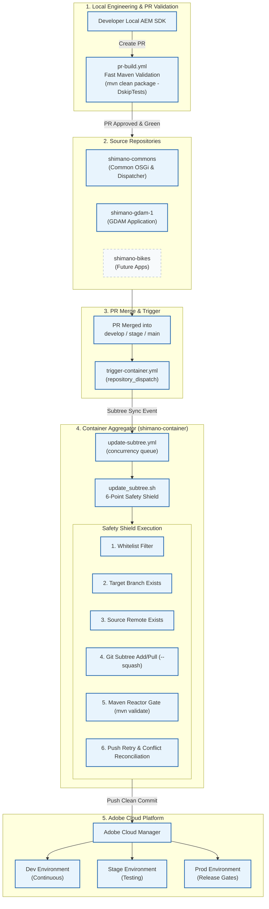
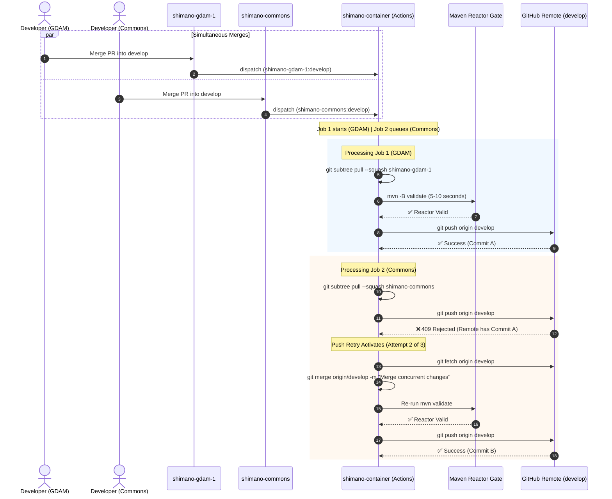

# Shimano Multi-Repository Delivery Architecture

> **Audience**: Development Teams, Tech Leads, DevOps & Security Engineers  
> **Repository**: `shimano-container` (Aggregator)  
> **Source Repositories**: `shimano-commons`, `shimano-gdam-1`, `shimano-bikes`

---

## 1. Architectural Blueprint & Delivery Lifecycle



---

## 2. Core Operational Pillars

### 1. Developer Autonomy
Developers work exclusively within their assigned source repository. They develop against their local AEM SDK, commit code, and open PRs without having to clone or build the entire platform reactor.

### 2. Fast PR Quality Feedback
Each source repository has a dedicated `.github/workflows/pr-build.yml` workflow:
- Command: `mvn -B clean package -DskipTests` (Fast build in ~1-2 min).
- Result: Fast feedback loops for developers on every pull request.
- Extensible: Ready to integrate SonarQube analysis and Veracode SAST scans.

### 3. Automated Subtree Synchronization
When a PR is merged into any whitelisted branch (`develop`, `stage`, `stage-*`, `release/*`, `main`):
1. `trigger-container.yml` in the source repository fires a `repository_dispatch` event (`subtree_sync`) with payload:
   ```json
   {
     "source_repo": "shimano-gdam-1",
     "source_branch": "develop",
     "commit_sha": "${{ github.sha }}",
     "actor": "${{ github.actor }}",
     "ref": "${{ github.ref }}"
   }
   ```
2. In `shimano-container`, the `.github/workflows/update-subtree.yml` workflow receives the event and executes `scripts/update_subtree.sh`.

---

## 3. The 6-Point Subtree Synchronization Safety Shield

`scripts/update_subtree.sh` enforces the following gates:

```
[Incoming Sync Event]
        │
        ▼
[Gate 1: Whitelist Filter] ─── NOT ALLOWED ───► Exit 0 (Skipped gracefully)
        │ ALLOWED
        ▼
[Gate 2: Container Branch Exists?] ─── NO ────► Exit 0 (Skip uninitialized branches)
        │ YES
        ▼
[Gate 3: Remote Source Branch Exists?] ── NO ─► Exit 1 (Fail fast, zero fallback)
        │ YES
        ▼
[Gate 4: Subtree Directory Check]
        ├── NOT FOUND ──► git subtree add --squash
        └── EXISTS ─────► git subtree pull --squash
        │
        ▼
[Gate 5: Maven Reactor Health Gate] ─── FAIL ─► Exit 1 (Abort push, protect container)
        │ PASS (mvn validate)
        ▼
[Gate 6: Safe Push & Push Retry]
        ├── UP TO DATE ─► Exit 0 (Idempotent)
        ├── SUCCESS ────► Pushed to remote
        └── 409 CONFLICT ──► Fetch, merge, re-validate, retry (up to 3x)
```

---

## 4. Concurrency & Push Retry Mechanism

When multiple pull requests are merged simultaneously across repositories (e.g. `shimano-commons` and `shimano-gdam-1` merged at the exact same moment):



---

## 5. Security & Organization Token Architecture

```
                      GitHub Organization: prash04-glf
                                     │
       ┌─────────────────────────────┴─────────────────────────────┐
       ▼                                                           ▼
Organization Secret:                                        Organization Variable:
CONTAINER_DISPATCH_TOKEN                                    ALLOWED_BRANCHES
(Read/Write repo scope)                                     (main,develop,stage,stage-*,release/*,hotfix/*)
       │                                                           │
       ├─────────────────────────────┬─────────────────────────────┤
       ▼                             ▼                             ▼
shimano-commons              shimano-gdam-1                shimano-container
(Inherits Secret)            (Inherits Secret)             (Inherits Secret)
```

- **Zero Duplication**: The token is stored once in Organization Secrets and inherited by all repositories.
- **Principle of Least Privilege**: Source repository workflow runs only require read access to their own code plus permission to dispatch to `shimano-container`.

---

## 6. Subtree Directory & POM Reactor Structure

```text
shimano-container/
├── .cloudmanager/
│   └── java-version            <-- Java 21 specification
├── .github/
│   └── workflows/
│       └── update-subtree.yml  <-- Subtree sync engine
├── scripts/
│   └── update_subtree.sh       <-- Safety shield & push retry script
├── all/                        <-- Central packaging container
├── dispatcher/                 <-- Adobe Cloud Manager dispatcher config
├── shimano-commons/            <-- Subtree prefix: shimano-commons
│   ├── core/
│   └── ui.config/
├── shimano-gdam-1/             <-- Subtree prefix: shimano-gdam-1
│   ├── core/
│   ├── ui.apps/
│   ├── ui.config/
│   ├── ui.content/
│   └── ui.frontend/
├── shimano-bikes/              <-- Subtree prefix: shimano-bikes (Future)
└── pom.xml                     <-- Parent reactor aggregating all subtrees
```

---

## 7. Troubleshooting & FAQ

#### Q1: A push happened in `shimano-gdam-1`, but the container didn't update. Why?
1. Check GitHub Actions in `shimano-gdam-1` → `Trigger Shimano Container Subtree Sync`.
2. Did the branch match `ALLOWED_BRANCHES`? If it was `feature/xyz`, it is skipped by design.
3. Check `CONTAINER_DISPATCH_TOKEN` secret validity.

#### Q2: What happens if two developers merge PRs in GDAM and Commons at the same second?
1. The GitHub `concurrency` group queues the two runs sequentially.
2. If both sync jobs overlap, Step 6 in `update_subtree.sh` catches the push conflict, fetches the latest container state, merges cleanly, re-runs `mvn validate`, and retries the push automatically.
