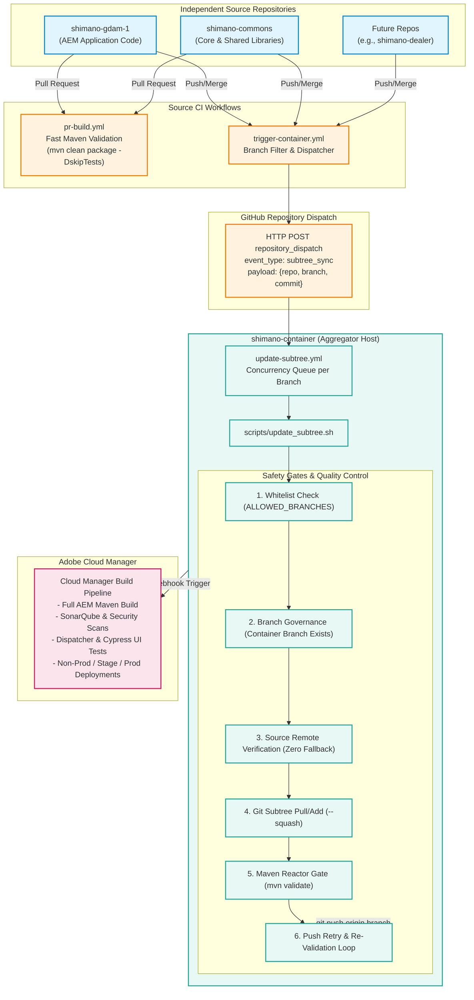
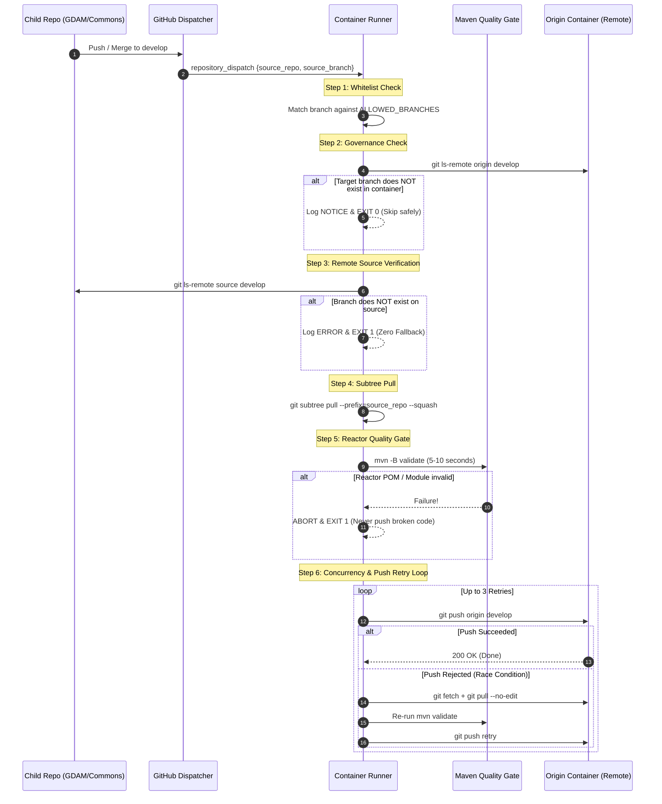

# Shimano Multi-Repository Aggregator Architecture & CI/CD Technical Specification

> **Audience**: Lead Engineers, DevOps / SRE, AEM Architects, and Technical Project Managers  
> **Platform**: Adobe Experience Manager as a Cloud Service (AEMaaCS), GitHub Actions, Git Subtree  
> **Confluence Space**: *Engineering > Architecture > Shimano DXP Platform*

---

## 1. Executive Technical Summary

The Shimano Experience Platform is structured as multiple independent source repositories (`shimano-gdam-1`, `shimano-commons`, and future sub-projects) aggregated into a single deployment container repository (`shimano-container`). 

This architecture provides:
- **Autonomous Developer Experience**: Teams work in isolated repositories with fast PR validations.
- **Unified Cloud Manager Deployment**: Adobe Cloud Manager builds from a single aggregated Git repository.
- **Automated Real-Time Subtree Synchronization**: GitHub Actions dispatches cross-repository sync events using `git subtree pull --squash`.
- **Failsafe Governance**: Controlled branch whitelisting, zero-fallback protection, and pre-push reactor quality gates.

---

## 2. End-to-End System Architecture



---

## 3. Detailed Component Deep-Dive

### 3.1. Source Repositories (`shimano-gdam-1`, `shimano-commons`)

Each child repository contains its own AEM modules:

```
shimano-gdam-1/
├── core/                # OSGi Bundles & Servlets
├── ui.apps/             # Components, HTL, Clientlibs
├── ui.content/          # Base Content & Experience Fragments
├── ui.config/           # OSGi Configuration Packages
├── ui.frontend/         # Webpack build (Node 18 / SCSS / TypeScript)
├── ui.tests/            # Cypress E2E Tests
└── .github/workflows/
    ├── pr-build.yml           # PR Build Quality Gate
    └── trigger-container.yml  # Container Dispatch Trigger
```

#### A. PR Verification (`pr-build.yml`)
- Runs on PR creation/update targeting `develop`, `main`, `stage`, `stage-*`, `release/**`, `hotfix/**`.
- Command: `mvn -B clean package -DskipTests` (Fast build in ~1-2 min).
- Can be enforced as a **Mandatory Status Check** via GitHub Branch Protection.

#### B. Subtree Dispatcher (`trigger-container.yml`)
- Triggered on direct `push` or PR `merge`.
- **Dynamic Branch Filtering**: Reads `vars.ALLOWED_BRANCHES`. If the commit branch does not match (e.g. `feature/JIRA-123`), the workflow exits in 3 seconds without consuming action minutes.
- **Dispatch Action**: Sends `repository_dispatch` to `prash04-glf/shimano-container` using `CONTAINER_DISPATCH_TOKEN`.

---

### 3.2. Aggregator Repository (`shimano-container`)

The container holds the Git Subtree prefixes and the root Maven aggregator `pom.xml`:

```
shimano-container/
├── .github/workflows/
│   └── update-subtree.yml     # Subtree orchestrator
├── scripts/
│   └── update_subtree.sh      # Core sync & quality gate engine
├── pom.xml                    # Root Reactor POM (aggregates commons + gdam-1)
├── shimano-commons/           # Subtree folder prefix
└── shimano-gdam-1/            # Subtree folder prefix
```

#### Maven Reactor Configuration (`pom.xml`)
```xml
<project xmlns="http://maven.apache.org/POM/4.0.0" ...>
    <modelVersion>4.0.0</modelVersion>
    <groupId>com.shimano.container</groupId>
    <artifactId>shimano-container</artifactId>
    <packaging>pom</packaging>
    <version>1.0.0-SNAPSHOT</version>

    <modules>
        <module>shimano-commons</module>
        <module>shimano-gdam-1</module>
    </modules>
</project>
```

---

## 4. Synchronization Logic & Failsafe Pipeline

The script [`scripts/update_subtree.sh`](../scripts/update_subtree.sh) implements 6 critical engineering protections:



---

## 5. Branch Mapping & Deployment Matrix

| Source Branch | Container Target Branch | Adobe Cloud Manager Environment | Auto Deploy? |
| :--- | :--- | :--- | :--- |
| `develop` | `develop` | **Dev / Non-Prod AEM Environment** | Yes (Continuous Delivery) |
| `stage` or `stage-*` | `stage` / matching | **Stage / QA Environment** | Yes / Scheduled |
| `release/*` | `release/*` | **Staging Pre-Prod Validation** | Manual approval |
| `main` | `main` | **Production Environment** | Cloud Manager Production Pipeline |
| `feature/*` | *N/A (Ignored)* | *Local SDK only* | No |

---

## 6. How to Onboard a New Repository (e.g. `shimano-dealer`)

### Step 1: Add Dispatch Workflow to New Repo
Create `.github/workflows/trigger-container.yml` in `shimano-dealer`:
```yaml
name: Trigger Shimano Container Subtree Sync
on:
  push:
    branches: [ main, develop, stage, 'stage-*', 'release/**', 'hotfix/**' ]
  workflow_dispatch:
...
```
Add `CONTAINER_DISPATCH_TOKEN` in `shimano-dealer` repository secrets.

### Step 2: Add Subtree to Aggregator POM
Edit `shimano-container/pom.xml`:
```xml
<modules>
    <module>shimano-commons</module>
    <module>shimano-gdam-1</module>
    <module>shimano-dealer</module>
</modules>
```

### Step 3: Initial Subtree Seed
```bash
git checkout develop
git subtree add --prefix=shimano-dealer https://github.com/prash04-glf/shimano-dealer.git develop --squash -m "Add shimano-dealer subtree"
git push origin develop
```
*From this point forward, every push to `develop` in `shimano-dealer` will auto-sync seamlessly.*

---

## 7. Troubleshooting & FAQ

#### Q1: A push happened in `shimano-gdam-1`, but the container didn't update. Why?
1. Check GitHub Actions in `shimano-gdam-1` $\rightarrow$ `Trigger Shimano Container Subtree Sync`.
2. Did the branch match `ALLOWED_BRANCHES`? If it was `feature/xyz`, it is skipped by design.
3. Check `CONTAINER_DISPATCH_TOKEN` secret validity.

#### Q2: What happens if two developers merge PRs in GDAM and Commons at the same second?
1. The GitHub `concurrency` group queues the two runs sequentially.
2. If both sync jobs overlap, Step 6 in `update_subtree.sh` catches the push conflict, fetches the latest container state, merges cleanly, re-runs `mvn validate`, and retries the push automatically.
